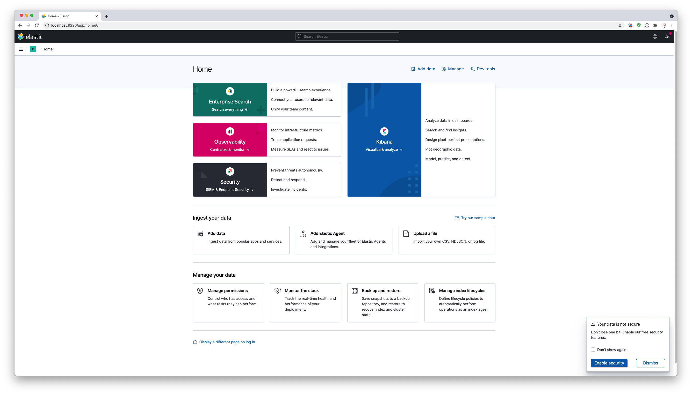

# Docker Elasticsearch AND Kibana

## 一、如何使用？

### Step1: 到服务器执行clone仓库

```shell
$ git clone git@github.com:docker-machine/docker.elasticsearch.kibana.git
```

### Step2: 运行docker容器链

进入到项目目录。

```shell script
$ cd docker.elasticsearch.kibana
```

使用make命令启动容器服务链。

```shell
$ make run
```

至此，Elasticsearch服务容器链(Elasticsearch+Kibana)已经运行。

## 二、如何停止当前容器链服务？

还是在当前项目目录，执行以下命令，即可将容器链停止掉，并且该容器链所创建的网卡也会被卸载！

```shell
$ make stop
```

## 三、其它容器服务该如何访问ElasticSearch容器服务?

```.env
# Host = docker_container_service_name:docker_container_service_internal_port，such as: 
Host = es01:9200
```

## 四、警告

请您注意了，在这个 `docker-compose.yml` 容器服务定义文件中，使用 `ES_JAVA_OPTS` 环境变量来手动将堆大小设置为512MB。我们不建议在生产中使用 `ES_JAVA_OPTS` 来限制堆大小。请参阅 [手动设置堆大小](https://www.elastic.co/guide/en/elasticsearch/reference/current/docker.html#docker-set-heap-size)。

## 五、扩展

ik中文分词如何使用可以参考：[README.IK.USE](README.IK.USE.md)。